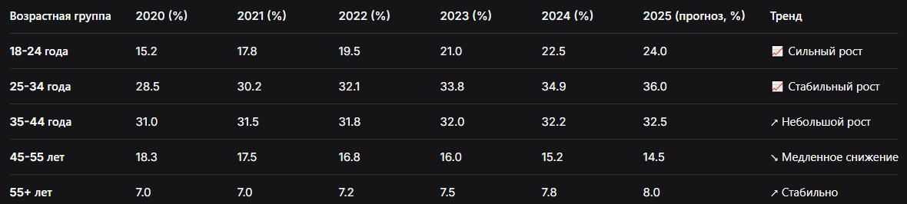

# 1.Формулировка задачи (Концепция)

# 1.1.Целевая аудитория:

Основная: Жители ближайших к ферме городов/районов (в радиусе 30-50 км), в возрасте 25-55 лет.

Семьи с детьми, заботящиеся о здоровом питании.

Приверженцы ЗОЖ и эко-сознательного потребления.

Люди, ценящие качество, свежесть и происхождение продуктов выше низкой цены.

Вторичная: Молодые люди, интересующиеся локальными брендами и поддержкой малого бизнеса; пожилые люди, ищущие "как раньше" натуральные продукты.

## 1.2.Целевой трафик и каналы привлечения:

Локальный SEO: Поиск по запросам "фермерские продукты с доставкой [Город]", "натуральное молоко [Город]", "эко продукты на дом".

Социальные сети (SMM): Instagram, Telegram-канал фермы. Контент: фото/видео с фермы, рассказы о животных, полезные факты.

Локальный маркетинг: Упоминания в городских пабликах, сотрудничество с кафе и эко-магазинами, сарафанное радио.

Целевые показатели (KPI): Увеличение конверсии из посетителя в заказчика с текущих 0% (если сайта нет) до 3-5%. Увеличение среднего чека за счет перекрестных предложений в корзине.

# 📊Таблица: Динамика покупателей натуральных продуктов по возрастам (2020-2025)

## 1.3.Продаваемое ценностное предложение (не просто товары):

Основной продукт: Удобный онлайн-заказ фермерских продуктов с доставкой.

Ключевая ценность: Доверие и прозрачность. Покупатель получает не абстрактный товар, а историю: знает, откуда продукты, кто и как их производит.

Выгоды для клиента: Свежесть, отсутствие химии, поддержка местного производителя, экономия времени на поездку на рынок.

## 1.4.Стратегия достижения цели:

Убеждение через контент: Яркие герои-фотографии, блок "О нас" с историей и лицами, детальные описания товаров (например, "Молоко от коров джерсейской породы, пасущихся на лугах").

Снижение барьера к покупке: Простой и наглядный интерфейс корзины, минимальное количество полей в форме заказа, указание цены за единицу.

Стимулирование решения: Ограниченные предложения ("Товар дня"), акцент на сезонности ("Свежий мед нового урожая"), отзывы реальных клиентов.

Техническая надежность: Быстрая загрузка сайта, адаптивность, четкая работа формы заказа (с подтверждением на email/SMS).

# 2.Техническое задание (Детализация)
Основа: Ваше ТЗ идеально подходит. Дополним деталями:

JavaScript Функционал:

Корзина: Хранение данных в localStorage, пересчет суммы, валидация количества.

Форма заказа: Валидация полей (телефон, email), отправка данных методом fetch на имитацию сервера (или на сервис типа Formspree на первом этапе), вывод модального окна "Спасибо за заказ!".

Плавная прокрутка по якорным ссылкам.

Адаптивность: Mobile-first подход. Контрольные точки: 320px, 768px, 1024px.

Производительность: Все изображения должны быть оптимизированы (сжаты, современные форматы .webp), минификация CSS/JS.

# 3.Этап проектирования

## 3.1.User Flow (Пользовательский сценарий):

Пользователь заходит на сайт с телефона (реклама в Instagram).

Видит герой-баннер с главным предложением и кнопкой "Смотреть ассортимент".

Листает до каталога, просматривает карточки товаров.

Нажимает "В корзину" на 2-3 товарах. Счетчик в шапке обновляется.

Кликает на иконку корзины -> открывается боковая панель/модальное окно с выбранным.

Нажимает "Оформить заказ" -> открывается форма с автоподстановкой товаров и итогом.

Заполняет форму (4-5 полей), нажимает "Подтвердить заказ".

Видит сообщение об успешной отправке и информацию "С вами свяжется менеджер".

## 3.2.Дизайн-проект (Макет в Figma):

Стиль: Эко-минимализм. Цветовая палитра: природные оттенки (зеленый #2e7d32, бежевый #f5f1e8, кремовый, темно-серый для текста).

Типографика: Читабельные рубленые шрифты для заголовков (например, Roboto Condensed) и классический sans-serif для текста (Open Sans).

Составляющие макета:

Мудборд (подборка атмосферных изображений).

Wireframe (схематичный каркас всех блоков).

Full Design Mockup: Полноцветные макеты для десктопа (1440px) и мобильного устройства (375px).

UI Kit: Кнопки, поля ввода, карточки товаров в разных состояниях (обычная, hover, pressed).

# 4.Оформленный репозиторий (GitHub)
Структура папок:

text
eco-lakomka/
├── index.html
├── README.md
├── .gitignore
├── assets/
│ ├── css/
│ │ ├── style.css
│ │ └── normalize.css
│ ├── js/
│ │ ├── script.js
│ │ ├── cart.js
│ │ └── form.js
│ ├── img/ (оптимизированные изображения)
│ └── fonts/
└── design/ (опционально - исходники из Figma)

# 5.Проект (Реализация)
Поэтапная разработка:

Базовая HTML-разметка всех секций.
Подключение стилей, базовая стилизация (CSS/SCSS).
Реализация адаптивной сетки (Flexbox/Grid).
Добавление интерактивности на JavaScript (меню-бургер, корзина).
Детальная стилизация, анимации, полировка.
Тестирование на разных устройствах и браузерах.
# 6.Оценка проекта

## 6.1.Критерии оценки:

Технические: Корректность и семантичность HTML, отсутствие ошибок в консоли, скорость загрузки (Google PageSpeed Insights), адаптивность.

Функциональные: Работоспособность всего заявленного функционала (корзина, форма, навигация).

Юзабилити (UX): Интуитивность, простота оформления заказа, читаемость текста.

Дизайн (UI): Соответствие макету, гармоничность цветов и шрифтов.

Бизнес-задачи: Наличие всех ключевых блоков (герой, преимущества, каталог, CTA, контакты).

## 6.2.Сравнение с конкурентами (анализ 2-3 сайтов других ферм):

Что делают хорошо: Больше живых фото, подробные описания.

Что делают плохо: Сложная форма заказа, нет адаптива, медленная загрузка.

Наше ключевое отличие: Более современный, чистый и клиентоориентированный дизайн, упор на удобство заказа с мобильного.

# 7.Оптимизация

## 7.1.Цель: Увеличить скорость загрузки, что напрямую влияет на конверсию и SEO.

## 7.2.Что оптимизируем: Размер и формат изображений, CSS/JS файлы, использование шрифтов.

## 7.3.Методы:

Конвертация изображений в .webp с fallback на .jpg.

Минификация CSS и JS.

Использование системных шрифтов или подмножества внешних шрифтов.

Отложенная загрузка изображений (lazy loading).
## 7.4.Результат: Целевой показатель — оценка Performance в Lighthouse > 90 баллов (против, например, 60 до оптимизации).

# 8.Обсуждение для развития / улучшений
База знаний/блог: Статьи о пользе продуктов, рецепты.

Личный кабинет: История заказов, избранные товары.

Система подписок: "Эко-корзина" на неделю.

Интеграция с Telegram-ботом для уведомлений о статусе заказа.

Онлайн-оплата картой.

